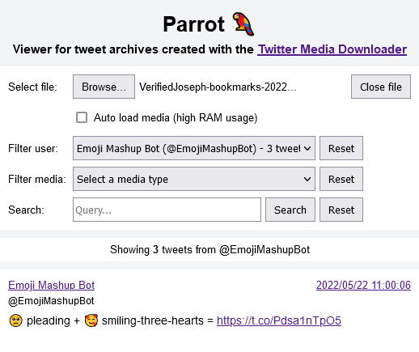

# Parrot 🦜

A browser-based viewer for tweet archives created with the [Twitter Media Downloader](https://github.com/furyutei/twMediaDownloader) browser extension.

## Dependencies
- [JSZip](https://github.com/Stuk/jszip) (v3.10.1) - JavaScript class for generating and reading zip files.
- [Papa Parse](https://github.com/mholt/PapaParse) (v5.4.1) - Fastest in-browser CSV parser for JavaScript.
- [Autolinker.js](https://github.com/gregjacobs/Autolinker.js) (v4.0.0) - Utility to automatically link URLs.

## Requirements

- Node.js >= 18.0
- npm

## License

MIT License. Please see [LICENSE](LICENSE) for more information.